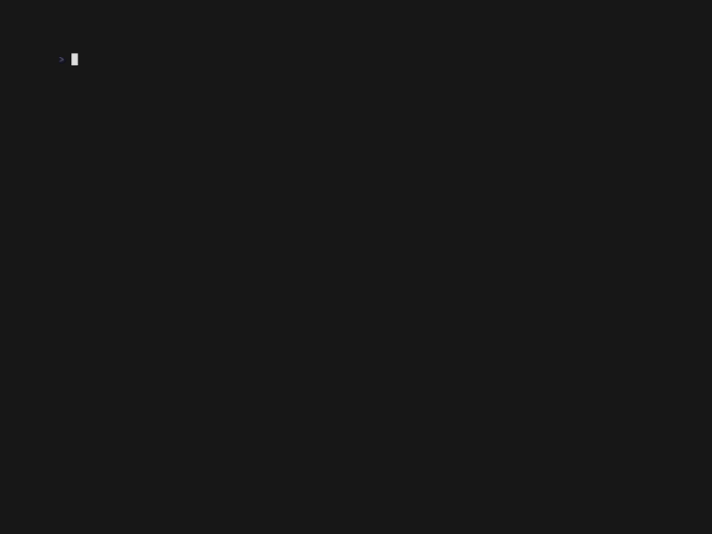

# Langton's Ant

A terminal-based simulation of Langton's Ant using Python and curses.



## What is Langton's Ant?
Langton's Ant is a two-dimensional Turing machine with simple rules that can produce complex emergent behavior. The "ant" moves on a grid, turning and flipping the color of each cell it visits, creating interesting patterns over time.

## Usage

1. Make sure you have Python 3 installed.
2. Run the program from your terminal:

```bash
python3 main.py
```

3. Press Ctrl+C to exit

You can edit the variables at the top of `main.py` to change the number of ants or how fast the simulation runs.